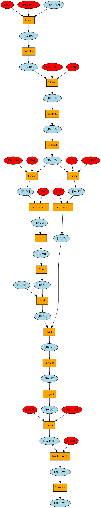
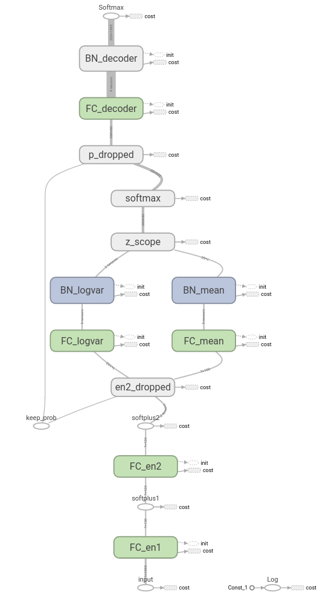

# PyTorch Implementation of Autoencoding Variational Inference for Topic Models

[Original Paper](https://arxiv.org/abs/1703.01488). 
[Original Tensorflow implementation](https://github.com/akashgit/autoencoding_vi_for_topic_models).

Much of the code and all of the data is copied from the above repo.

What this repo contains:
- `pytorch_run.py`: PyTorch code for training, testing and visualizing AVITM
- `pytorch_model.py`: PyTorch code for ProdLDA
- `pytorch_visualize.py`: code for PyTorch graph visualization
- `tf_run.py`: Tensorflow code for training and testing AVITM, entirely copied from source repo.
- `tf_model.py`: Tensorflow code for ProdLDA, adapted from source repo.
- `data` folder: 20Newsgroup dataset, entirely copied from source repo.

Note that the tensorflow implementation prints the topic words first, then has to wait a few seconds to print the
perplexity, as testing right now isn't parallelized.

# Running the code

Code can be run with pytorch 0.1.12. Subsequent versions of pytorch upgraded several interface and broke the code.

```bash

# PyTorch version
python pytorch_run.py --start

# Tensorflow version
python tf_run.py -p

```

Tunable parameters for both scripts:

```bash
-f 100   # hidden layer size of encoder1
-s 100   # hidden layer size of encoder2
-t 50    # number of topics
-b 200   # batch size
-e 80    # number of epochs to train
-r 0.002 # learning rate
```

Tunable parameters for PyTorch script:

```bash
-m 0.99  # momentum
-v 0.995 # variance in the prior
```

If you want to run the tensorflow code, please note that I'm using tensorflow 1.1. If you use an older version there
might be compatibility issues (some difference in interface, for example `tf.mul` becomes `tf.multiply`).


# Sample output

```
xxx@xxx:xxx/pytorch_avitm$ python pytorch_run.py --start
Converting data to one-hot representation
Data Loaded
Dim Training Data (11258, 1995)
Dim Test Data (7487, 1995)
Epoch 0, loss=779.540215743
Epoch 5, loss=682.539052863
Epoch 10, loss=665.758558307
Epoch 15, loss=660.786747447
Epoch 20, loss=646.323563425
Epoch 25, loss=639.089690627
Epoch 30, loss=638.143001623
Epoch 35, loss=632.981146561
Epoch 40, loss=626.119186669
Epoch 45, loss=622.517933093
Epoch 50, loss=619.359790467
Epoch 55, loss=618.568074544
Epoch 60, loss=622.428580301
Epoch 65, loss=613.454376756
Epoch 70, loss=614.152974447
Epoch 75, loss=614.537361547
---------------Printing the Topics------------------
midea
     lebanese arab israel lebanon israeli arabs palestinian peace village civilian
sport
     cup wings leafs gm st coach playoff det rangers montreal
sport
     player defensive offense coach hitter playoff braves pitcher deserve pitch
comp 
     jpeg gif converter compression xlib official extension fund stephanopoulos toolkit

     abuse legitimate anonymous cryptography usenet secure privacy server mechanism directory

     cs push ax ah al null db byte oname bh
jesus
     doctrine eternal bible christ jesus pray church sin holy god

     mw eus ax sl bhj mg mi pl pd rg
nasa 
     spacecraft nasa star medical volume patient japanese mission culture rocket
comp 
     dos shipping printer manual parallel adapter software port remote video

     thanks uucp _eos_ georgia appreciate kevin curious anyone hus gordon
polit|crime
     firearm amendment minority crime militia homicide federal prohibit assault weapon
gears
     bike honda bmw sport _eos_ ground wave andy front motorcycle
gears
     bike battery gear helmet plug dealer mile transmission oil amp

     turkish turks island muslim mountain armenia war armenian southern village
comp 
     ide scsi quadra scsus isa spec cpu cache mhz meg

     mw sl bio mi jumper wm mb connector mg adapter
nasa 
     spacecraft nasa rocket km orbit shuttle solar mission star billion

     oname contest remark winner entry prior output char null io
gears|car  
     bike dog rider wheel ride oil accident safety helmet batf

     wire wiring voltage neutral ground nec trip outlet panel circuit
comp 
     xterm cpu font binary extension vga workstation server toolkit distribution
crime
     apartment girl rape armenians neighbor soldier burn hide woman armenian

     stephanopoulos apartment myers meeting armenians february job consideration walk federal

     puck player score acquire penalty game cup playoff offense defense

     annual player cup excellent hockey app sport green nhl update

     annual june origin shipping papers copy rider excellent nasa print
comp 
     screen gateway swap meg menu font frame mouse setup colormap
comp 
     workstation hp database graphics amiga dec render processing frame directory
jesus
     eternal sin heaven faith jesus pray christianity bible god resurrection
jesus
     absolute doctrine bible scripture truth interpretation belief faith god christianity

     pp winnipeg pt rangers louis minnesota philadelphia calgary jose montreal

     gateway quadra vga mouse card video port boot setup ram
crime
     weapon crime criminal violent gun batf gang firearm insurance accident

     mw cross cache link motherboard ram sl wm eus unit

     enforcement encrypt escrow key clipper ripem secure algorithm chip session

     det cup que van tor pit gm leafs wings playoff
gears|car  
     bike helmet gear rear detector honda wheel saturn dealer engine
midea
     islamic islam atheist israel religious israeli muslims atheism arab religion
jesus
     passage jesus verse prophecy worship matthew scripture doctrine biblical holy

     escrow clipper wiretap crypto secure nsa scheme proposal chip warrant

     phil germany april _eos_ curious usa gordon ticket associate reserve

     enforcement americans federal conversation policy encryption legitimate militia clipper economic
gears|sport|car  
     gear pitch hitter hit ab helmet rear wheel player worst

     battery amp brand modem shipping electronics voltage external hus audio

     armenia turks turkish genocide armenians armenian muslim escape nazi minority
comp 
     button font menu expose specify screen xterm colormap render event
midea
     oo israeli palestinian pl sl rg israel bhj arab arabs

     hus shipping thanks brand appreciate hello condition advance gateway tube

     moral morality reasoning evidence definition existence science conclusion murder objective
---------------End of Topics------------------
('The approximated perplexity is: ', 1152.8633604900842)

```
# PyTorch Graph visualization

Red nodes are weights, orange ones operations, and blue ones variables. Input at top, output at bottom.




# Tensorflow Graph visualization

Visualization with Tensorboard. Gives a better high-level overview. Note input is at the bottom, and output is at the
top.



